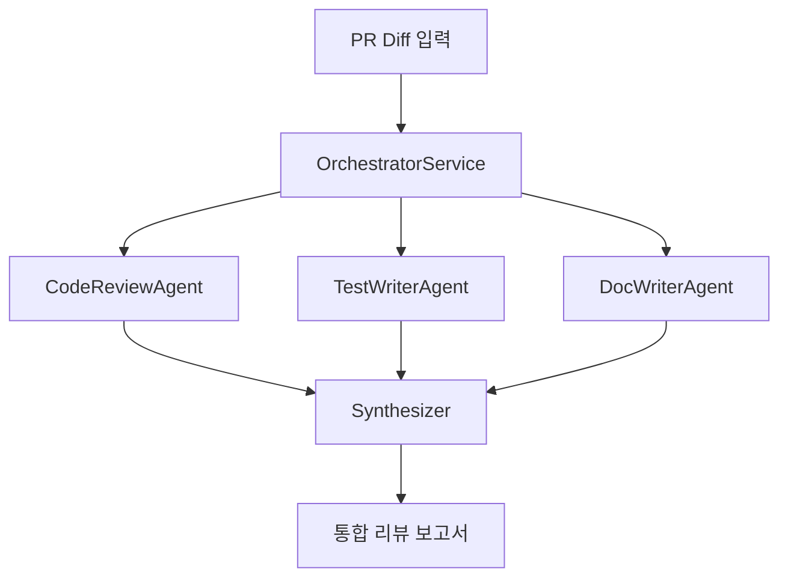

# Week 08 미션: "단일 에이전트로는 여러 작업을 잘 처리할 수 없습니다"

## 상황

FAQ 챗봇이 운영 중입니다. 팀이 성장했습니다 — 이제 5명의 엔지니어가 이를 구동하는 코드베이스에
기여하고 있습니다. 매일 PR이 올라옵니다.

팀 리더가 말합니다:

> "AI 서비스 PR 리뷰에 검토 시간 절반을 쓰고 있어요. 검색 전략 변경, 프롬프트 조정,
> 새 툴 통합 — 모두 세심한 검토가 필요합니다.
> 최소한 첫 번째 패스를 자동화할 수 있을까요? 코드를 검토하고, 테스트 케이스를 제안하고,
> 문서를 업데이트하세요. 프롬프트 하나로. 완전 자동화."

명백한 접근 방식을 시도합니다: 하나의 큰 프롬프트.

```
당신은 시니어 엔지니어입니다. PR 변경 사항(diff)을 바탕으로 다음을 수행하세요:
1. 버그, 스타일 문제, 보안 문제를 코드 리뷰합니다.
2. 단위 및 통합 테스트 케이스를 제안합니다.
3. 문서 업데이트를 제안합니다.
결과를 구조화된 형식으로 반환하세요.
```

어느 정도 작동하지만 결과가 얕습니다. 코드 리뷰가 엣지 케이스를 놓칩니다.
테스트 제안이 일반적입니다. 문서 업데이트가 모호합니다.

문제는 근본적입니다:

> **3가지 다른 작업을 하려는 단일 에이전트는 아무것도 잘 못합니다.**

**멀티 에이전트 워크플로우**가 필요합니다 — 각각 하나의 일을 하는 전문 에이전트들이
워크플로우 패턴으로 조율됩니다.

## 요구사항

### 목표

**멀티 에이전트 워크플로우 패턴**을 사용해 PR 리뷰 봇을 만드세요. 각 에이전트는 전문가입니다:

| 에이전트 | 담당 |
|-------|---------------|
| `CodeReviewAgent` | 버그, 스타일, 보안, 성능에 대한 코드 변경 분석 |
| `TestWriterAgent` | 변경 사항에 대한 구체적이고 실행 가능한 테스트 케이스 제안 |
| `DocWriterAgent` | 변경 사항 기반 문서 업데이트 제안 |

### 워크플로우 패턴

Spring AI 문서에서 다음 3가지 워크플로우 패턴 중 **최소 2가지**를 구현해야 합니다:

1. **Chain** — 에이전트가 순차적으로 실행됩니다. 에이전트 A의 출력이 에이전트 B의 입력으로 들어갑니다.
   예: CodeReview -> TestWriter (테스트가 발견된 이슈를 대상으로 함) -> DocWriter (문서가 수정 사항 반영).

2. **Routing** — 분류기가 입력을 검토하고 적절한 에이전트로 라우팅합니다.
   예: PR이 순수 문서 변경이면 코드 리뷰와 테스트 작성을 건너뜁니다.

3. **Orchestrator-Worker** — 중앙 오케스트레이터가 작업을 분해하고, 워커 에이전트에게
   서브태스크를 병렬로 (또는 DAG 순서로) 전달하고, 최종 결과를 합성합니다.

### 아키텍처



### 비교

**같은 PR diff**를 다음으로 실행:
1. 단일 프롬프트 방식 (LLM 호출 1번, 모든 작업)
2. 멀티 에이전트 방식

다음 기준으로 비교:

| 차원 | 단일 프롬프트 | 멀티 에이전트 |
|-----------|--------------|-------------|
| 코드 리뷰 깊이 | ? | ? |
| 테스트 케이스 구체성 | ? | ? |
| 문서 업데이트 관련성 | ? | ? |
| 총 지연시간 | ? | ? |
| 총 토큰 사용량 | ? | ? |

### 완료 기준

`src/test/` 디렉터리의 테스트가 인수 기준을 정의합니다:
- 3개 에이전트 모두 `Agent` 인터페이스를 구현하고 의미 있는 출력을 생성한다
- 최소 2가지 워크플로우 패턴이 구현되고 설정으로 전환할 수 있다
- 오케스트레이터가 올바른 순서로 에이전트를 실행하고 결과를 결합한다
- 단일 프롬프트와 멀티 에이전트 방식의 비교가 문서화된다

## 시작하는 방법

`src/main/java/com/jaeyeonling/week08/`를 열어보세요 — 스켈레톤 코드가 있습니다.
`// TODO:` 주석을 찾아보세요. 그곳에 코드를 작성하면 됩니다.

`Agent` 인터페이스가 정의되어 있습니다. 세 에이전트와 오케스트레이터를 구현하세요.

## 힌트

막혔나요? `hints/` 폴더를 확인하세요 — 단, 먼저 혼자 시도해보세요.

| 힌트 | 이럴 때 열어보세요 |
|------|-------------------|
| `HINT_01.md` | Chain 워크플로우 패턴과 에이전트 출력 파이핑 방법을 이해하고 싶을 때 |
| `HINT_02.md` | Routing 구현 — 입력을 분류하고 적절한 에이전트로 전달하고 싶을 때 |
| `HINT_03.md` | 작업 분해가 포함된 Orchestrator-Worker 패턴을 만들고 싶을 때 |
