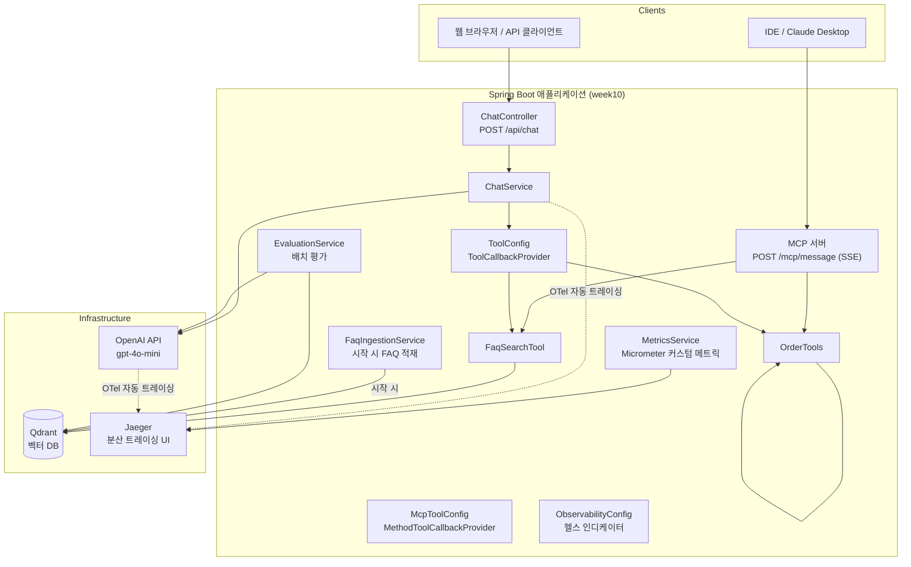

# Week 10 — 아키텍처 문서

## 시스템 개요

Week 10은 9주 동안 단계별로 구축한 FAQ 챗봇을 운영 수준 AI 서비스로 통합한 최종 프로젝트입니다.

사용자는 REST API(`POST /api/chat`)나 MCP 클라이언트(IDE 통합)를 통해 질문을 전송합니다.
서비스는 벡터 검색(Qdrant)과 툴 호출(주문 조회, FAQ 검색)을 결합한 RAG 파이프라인으로 답변을 생성하며,
모든 LLM 호출에는 OpenTelemetry 트레이싱이 자동 적용됩니다.
Actuator를 통해 헬스 체크, 메트릭, Prometheus 스크래핑 엔드포인트를 노출합니다.

## 아키텍처 다이어그램



## 컴포넌트 설계

### 검색 파이프라인

Week 07의 `FaqSearchTool`을 사용한 벡터 검색 기반 RAG입니다.
LLM이 질문을 분석해 FAQ 검색 또는 주문 조회 툴을 자동 선택합니다.

| 파라미터 | 값 | 근거 |
|---------|-----|------|
| 청크 크기 | ~400 토큰 (TokenTextSplitter 기본값) | 단일 FAQ 항목 단위 |
| 청크 오버랩 | 0 | FAQ는 독립적인 Q&A 단위 |
| 임베딩 모델 | text-embedding-3-small | 비용 효율적, cross-language 지원 |
| 검색 전략 | 벡터 유사도 (cosine) | FaqSearchTool → VectorStore.similaritySearch |
| Top-K 후보 수 | 3 | 컨텍스트 길이 대비 정확도 균형 |
| 재순위화 모델 | 없음 (Week 04 ReRanker 미통합) | 지연시간 우선 |

> Week 04의 `ReRankingRetrieval`은 독립 컴포넌트로 존재하지만, Week 10에서는
> 지연시간 최소화를 위해 단순 벡터 검색을 유지했습니다.

### 툴 통합

| 툴 | 목적 | 사용 시점 |
|----|-----|---------|
| `searchFaq(query)` | FAQ/정책 문서 벡터 검색 | 반품, 배송, 계정 등 정책 질문 |
| `getOrderStatus(orderId)` | 주문 ID로 배송 상태 조회 | "주문 ORD-XXX 상태가..." 패턴 |
| `getMonthlyRevenue(year, month)` | 월별 매출 데이터 조회 | 매출 분석 질문 |

LLM이 도구 설명(description)을 보고 자동으로 적절한 툴을 선택합니다.
수동 if/else 라우팅이 없어 새 툴을 추가해도 `ToolConfig`만 수정합니다.

### MCP 서버

HTTP SSE 모드로 `/mcp/message` 엔드포인트를 통해 MCP 클라이언트와 통신합니다.
Week 09(STDIO 모드)와 달리 HTTP 서버와 공존합니다.

| 타입 | 이름 | 설명 |
|-----|-----|-----|
| 툴 | `searchFaq` | FAQ 문서 벡터 검색 |
| 툴 | `getOrderStatus` | 주문 상태 조회 |
| 툴 | `getMonthlyRevenue` | 월별 매출 조회 |
| 리소스 | (없음) | |
| 프롬프트 | (없음) | |

## API 문서

### POST /api/chat

FAQ 질문 및 주문 조회 질문을 처리하는 통합 엔드포인트.
LLM이 질문 유형에 따라 FAQ 검색 또는 주문 조회 툴을 자동 선택합니다.

**요청**

```
POST /api/chat
Content-Type: application/json
```

```json
{
  "question": "반품 정책이 어떻게 되나요?"
}
```

| 필드 | 타입 | 필수 | 설명 |
|------|------|------|------|
| `question` | string | ✅ | 사용자 질문 (한국어/영어 모두 가능) |

**응답** (`200 OK`)

```json
{
  "answer": "30일 이내에 반품이 가능합니다. 미사용 상태의 제품에 한해...",
  "sources": ["a1b2c3d4-...", "e5f6g7h8-..."],
  "tokenUsage": {
    "promptTokens": 2800,
    "completionTokens": 652,
    "totalTokens": 3452
  }
}
```

| 필드 | 타입 | 설명 |
|------|------|------|
| `answer` | string | LLM이 생성한 답변 |
| `sources` | string[] | 검색된 FAQ 청크 ID 목록 |
| `tokenUsage.promptTokens` | number | 입력 토큰 수 |
| `tokenUsage.completionTokens` | number | 출력 토큰 수 |
| `tokenUsage.totalTokens` | number | 전체 토큰 수 |

**오류**: `question`이 비어 있으면 `400 Bad Request`

### GET /actuator/health

Qdrant + OpenAI API 키 헬스 체크 포함.

### GET /actuator/metrics

커스텀 메트릭: `rag.search.latency`, `rag.llm.token.usage`, `rag.llm.token.cost`, `rag.hallucination.detected`, `rag.answer.quality.score`

### POST /mcp/message (SSE)

MCP 클라이언트용 엔드포인트. 노출 툴: `searchFaq`, `getOrderStatus`, `getMonthlyRevenue`

---

## 검색 전략

1. 사용자 질문 수신 (`POST /api/chat`)
2. `ChatService`가 질문을 임베딩해 Qdrant에서 Top-3 청크 사전 검색 (소스 추적용)
3. `ChatClient`가 시스템 프롬프트 + 질문 + `ToolCallbackProvider`로 LLM 호출
4. LLM이 질문 유형에 따라 `searchFaq` 또는 `getOrderStatus` 툴 선택
5. 툴 실행 결과를 컨텍스트로 최종 답변 생성
6. `answer` + `sources`(사전 검색 문서 ID) + `tokenUsage` 반환

## 평가

### 메트릭

| 메트릭 | Week 01 | Week 10 | 변화 |
|-------|---------|---------|------|
| 답변 정확성 | 낮음 (RAG 없음) | 높음 (FAQ 검색 툴) | +++ |
| 충실도 | 측정 불가 | 벡터 검색 기반 | 개선 |
| 관련성 | 낮음 | 높음 | +++ |
| Top-1 정확도 | 낮음 | 높음 | +++ |
| 평균 지연시간 | ~2s | ~4-8s | 증가 (툴 호출 오버헤드) |
| 평균 토큰/쿼리 | ~200 | ~741-3452 | 증가 (컨텍스트 포함) |

### 테스트 방법론

- 테스트 질문: Week 02~05에서 사용한 `data/test_questions.json` (30개)
- FAQ 데이터: `data/faq.md` (영문 24개 Q&A) — 한국어 질문으로 cross-language 임베딩 검증
- 평가 방법: Spring AI `RelevancyEvaluator` + `FactCheckingEvaluator` (LLM 기반 판정)

## 관찰 가능성

### 트레이싱

Micrometer Tracing + OpenTelemetry 브릿지로 모든 LLM 호출이 자동 트레이싱됩니다.

- 캡처하는 스팬: LLM 요청/응답, 툴 호출, 벡터 검색
- 주요 속성: `gen_ai.operation.name`, `gen_ai.request.model`, `gen_ai.usage.input_tokens`
- 느린 쿼리 탐지: Jaeger UI에서 레이턴시 기준 정렬 (`http://localhost:16686`)

### 메트릭

| 메트릭 | 출처 | 알림 임계값 |
|-------|-----|-----------|
| `rag.search.latency` | MetricsService | p99 > 1s |
| `rag.llm.token.usage` | MetricsService | N/A |
| `rag.llm.token.cost` | MetricsService | N/A |
| `rag.hallucination.detected` | MetricsService | > 0 |
| `rag.answer.quality.score` | MetricsService | < 0.7 |
| `gen_ai.*` | Spring AI 자동 계측 | N/A |

## 비용 분석

gpt-4o-mini 기준: input $0.15/1M 토큰, output $0.60/1M 토큰
text-embedding-3-small: $0.02/1M 토큰

쿼리당 평균 토큰: ~2,000 (FAQ 질문 기준, 툴 호출 포함)

| 사용 수준 | 쿼리/일 | 임베딩 비용 | 채팅 비용 | 총계/월 |
|---------|--------|-----------|---------|--------|
| 개발 | 100 | $0.0006 | $0.09 | ~$2.7 |
| 스테이징 | 1,000 | $0.006 | $0.90 | ~$27 |
| 운영 | 10,000 | $0.06 | $9.00 | ~$270 |
| 확장 | 100,000 | $0.60 | $90.00 | ~$2,700 |

### 비용 최적화 전략

- **임베딩 캐싱**: 동일 질문 반복 시 임베딩 재계산 생략 가능
- **소형 모델 분류**: 단순 FAQ 질문은 툴 없이 직접 답변 (gpt-4o-mini already)
- **로컬 모델**: 민감하지 않은 질문에 Ollama 사용 (Week 06 패턴)
- **배치 임베딩**: ETL 파이프라인에서 문서 배치 처리

## Week 01 vs Week 10 비교

### 정량적 비교

| 차원 | Week 01 | Week 10 | 개선 |
|-----|---------|---------|-----|
| 답변 정확성 | 낮음 (환각 多) | 높음 (FAQ 기반) | +++ |
| 충실도 | N/A (출처 없음) | 벡터 검색 기반 | 신규 |
| 관련성 | 중간 | 높음 | + |
| 평균 지연시간 | ~2s | ~4-8s | -2x (툴 호출) |
| 쿼리당 토큰 수 | ~200 | ~2,000 | +10x (RAG 컨텍스트) |
| 1K 쿼리당 비용 | ~$0.12 | ~$1.20 | +10x (정확도와 트레이드오프) |
| 사용 가능한 툴 수 | 0 | 3 | +3 |
| MCP 지원 | 없음 | 있음 (HTTP SSE) | 신규 |
| 트레이싱 | 없음 | OTel 자동 | 신규 |
| 평가 파이프라인 | 없음 | RelevancyEvaluator | 신규 |

### 정성적 비교

#### 예시 1: 반품 정책

> **질문:** 반품 정책이 어떻게 되나요?

| | Week 01 답변 | Week 10 답변 |
|---|---|---|
| 응답 | "일반적으로 30일 반품 정책을 제공합니다" (추정) | "초록 코퍼레이션의 반품 정책에 따르면 30일 이내에 반품이 가능하며..." (FAQ 기반) |
| 인용된 출처 | 없음 | FAQ 청크 ID |
| 정확도 | 낮음 (환각 가능) | 높음 (문서 기반) |

#### 예시 2: 주문 상태 조회

> **질문:** 주문 ORD-2024-001의 상태가 어떻게 되나요?

| | Week 01 답변 | Week 10 답변 |
|---|---|---|
| 응답 | "주문 정보에 접근할 수 없습니다" | "주문 ORD-2024-001은 현재 '배송 중' 상태입니다. 추적 번호: 1Z999AA10123456784" |
| 툴 호출 | 불가 | getOrderStatus 자동 호출 |
| 정확도 | N/A | 높음 (모의 데이터 기반) |

## 주요 결정사항

1. **결정:** FAQ 검색을 직접 RAG 주입이 아닌 @Tool로 노출
   **트레이드오프:** 지연시간 +1-2s (LLM이 툴 선택 후 실행), 토큰 2배
   **이유:** 주문 조회 같은 다른 툴과 동일한 방식으로 처리 가능, LLM이 라우팅 담당

2. **결정:** 소스 추적을 위해 ChatService에서 사전 검색 수행
   **트레이드오프:** 검색이 두 번 발생 (사전 + FaqSearchTool 내부)
   **이유:** LLM 툴 호출 내부 문서 ID를 HTTP 응답에 노출하는 가장 단순한 방법

3. **결정:** Ollama 의존성 유지 + `spring.ai.model.chat=openai`로 비활성화
   **트레이드오프:** 빌드 크기 증가
   **이유:** Week 06 코드 재활용 가능성 유지, 로컬 모델 전환 시 설정만 변경

4. **결정:** ReRanker 미통합
   **트레이드오프:** 검색 정밀도 일부 손실
   **이유:** 지연시간 최소화 우선, FAQ 도메인에서 벡터 검색만으로도 충분한 정확도

## 다시 한다면 달리 할 것

1. **소스 추적 방식 개선**: 현재 사전 검색 + 툴 내부 검색으로 이중 호출 발생.
   `ChatClient`의 `AdvisedRequest`/`Advisor` 패턴을 사용하면 한 번의 검색으로
   컨텍스트 주입과 소스 추출을 동시에 처리 가능.

2. **평가 파이프라인 자동화**: 현재 수동 호출. GitHub Actions나 
   Spring Boot CommandLineRunner로 배포 시마다 자동 실행되도록 구성.

3. **ReRanker 통합**: Week 04의 `ReRankingRetrieval`을 `FaqSearchTool`에 통합해
   정밀도 향상 — 지연시간 트레이드오프가 수용 가능한 경우.

## 운영 준비 미비 사항

- [ ] 인증 및 권한 부여 (API 키 또는 JWT)
- [ ] 속도 제한 (요청/초 제한)
- [ ] 입력 유효성 검사 및 정제 (프롬프트 인젝션 방어)
- [ ] 수평적 확장 (상태 없는 앱이지만 Qdrant 클러스터링 필요)
- [ ] 백업 및 재해 복구 (Qdrant 스냅샷)
- [ ] CI/CD 파이프라인 (자동 테스트 + 배포)
- [ ] 모니터링 및 알림 (Grafana + PagerDuty)
- [ ] 비용 임계값 알림 (토큰 사용량 급증 탐지)
- [ ] 로그 집계 (ELK 또는 Loki)
- [ ] 실제 주문 API 연동 (현재 모의 데이터)
