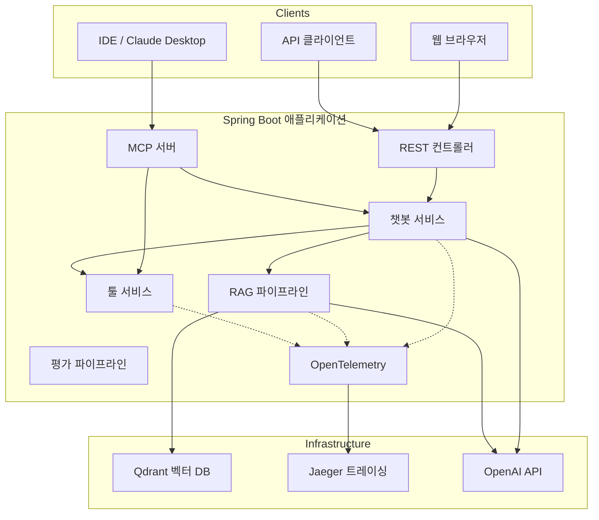

# Week 10 — 아키텍처 문서

## 시스템 개요

<!-- TODO: 운영 AI 서비스에 대한 2-3단락 설명을 작성하세요.
     무엇을 하는가? 누구를 위한 것인가? 어떤 문제를 해결하는가? -->

## 아키텍처 다이어그램

<!-- TODO: 실제 아키텍처에 맞게 이 다이어그램을 업데이트하세요.
     구축한 추가 컴포넌트를 추가하세요. -->

## 컴포넌트 설계

### 검색 파이프라인

<!-- TODO: 검색 전략을 설명하세요.
     - week 04의 어떤 전략을 사용하고 있나요?
     - 벡터 검색, 키워드 검색, 재순위화를 어떻게 결합하나요?
     - 청킹 파라미터는 무엇인가요? -->

| 파라미터 | 값 | 근거 |
|---------|-----|------|
| 청크 크기 | ? | |
| 청크 오버랩 | ? | |
| 임베딩 모델 | text-embedding-3-small | |
| 검색 전략 | ? | |
| Top-K 후보 수 | ? | |
| 재순위화 모델 | ? | |

### 툴 통합

<!-- TODO: 툴과 그 기능을 나열하세요.
     - LLM이 접근할 수 있는 툴은 무엇인가요?
     - LLM은 언제 각 툴을 사용하도록 선택하나요?
     - 툴 오류는 어떻게 처리하나요? -->

| 툴 | 목적 | 사용 시점 |
|----|-----|---------|
| ? | ? | ? |
| ? | ? | ? |

### MCP 서버

<!-- TODO: MCP 프리미티브를 문서화하세요.
     - 어떤 툴이 노출되어 있나요?
     - 어떤 리소스를 사용할 수 있나요?
     - 어떤 프롬프트 템플릿이 정의되어 있나요? -->

| 타입 | 이름 | 설명 |
|-----|-----|-----|
| 툴 | ? | ? |
| 리소스 | ? | ? |
| 프롬프트 | ? | ? |

## 검색 전략

<!-- TODO: 검색 접근 방식을 자세히 설명하세요.
     - 검색 파이프라인은 엔드투엔드로 어떻게 생겼나요?
     - 구현에서 하이브리드 검색은 어떻게 작동하나요?
     - 어떤 재순위화 방식을 사용했나요? -->

## 평가

### 메트릭

<!-- TODO: 평가 결과를 채우세요. -->

| 메트릭 | Week 01 | Week 10 | 변화 |
|-------|---------|---------|------|
| 답변 정확성 | | | |
| 충실도 | | | |
| 관련성 | | | |
| Top-1 정확도 | | | |
| 평균 지연시간 (ms) | | | |
| 평균 토큰/쿼리 | | | |

### 테스트 방법론

<!-- TODO: 평가 실행 방법을 설명하세요.
     - 테스트 질문은 몇 개인가요?
     - 어떻게 선택했나요?
     - 각 메트릭을 어떻게 측정했나요? -->

## 관찰 가능성

### 트레이싱

<!-- TODO: 트레이싱 설정을 설명하세요.
     - 어떤 스팬을 캡처하나요?
     - 어떤 속성이 기록되나요?
     - 느린 쿼리를 어떻게 찾나요? -->

### 메트릭

<!-- TODO: 추적하는 핵심 메트릭을 나열하세요.
     - 요청 지연시간
     - 토큰 사용량
     - 오류율
     - 캐시 히트율 (해당되는 경우) -->

| 메트릭 | 출처 | 알림 임계값 |
|-------|-----|-----------|
| ? | ? | ? |

## 비용 분석

<!-- TODO: 다양한 사용량 수준에서 비용을 추정하세요. -->

| 사용 수준 | 쿼리/일 | 임베딩 비용 | 채팅 비용 | 총계/월 |
|---------|--------|-----------|---------|--------|
| 개발 | 100 | ? | ? | ? |
| 스테이징 | 1,000 | ? | ? | ? |
| 운영 | 10,000 | ? | ? | ? |
| 확장 | 100,000 | ? | ? | ? |

### 비용 최적화 전략

<!-- TODO: 비용을 줄이기 위해 사용하거나 사용할 전략은 무엇인가요?
     - 임베딩 캐싱
     - 분류를 위한 소형 모델
     - 요청 배치 처리
     - 중요하지 않은 작업에 로컬 모델 (Ollama) 사용 -->

## Week 01 vs Week 10 비교

<!-- TODO: 이것이 가장 중요한 섹션입니다. 동일한 30개의 테스트 질문을
     week 01과 week 10 구현 모두에 통과시키세요. -->

### 정량적 비교

| 차원 | Week 01 | Week 10 | 개선 |
|-----|---------|---------|-----|
| 답변 정확성 | | | |
| 충실도 | N/A (출처 없음) | | |
| 관련성 | | | |
| 평균 지연시간 | | | |
| 쿼리당 토큰 수 | | | |
| 1K 쿼리당 비용 | | | |
| 사용 가능한 툴 수 | 0 | | |
| MCP 지원 | 없음 | 있음 | |

### 정성적 비교

<!-- TODO: week 10이 week 01보다 명확히 우수한 3-5개의 질문을 선택하세요.
     질문, 두 답변, 그리고 week 10이 왜 더 나은지 설명하세요. -->

#### 예시 1

> **질문:** (작성)

| | Week 01 답변 | Week 10 답변 |
|---|---|---|
| 응답 | | |
| 인용된 출처 | 없음 | |
| 정확도 | | |

## 주요 결정사항

<!-- TODO: 내린 3-5가지 가장 중요한 기술적 결정과
     관련된 트레이드오프를 문서화하세요. -->

1. **결정:** ...
   **트레이드오프:** ...
   **이유:** ...

## 다시 한다면 달리 할 것

<!-- TODO: 사후에 돌아보면 무엇을 바꾸겠나요? -->

## 운영 준비 미비 사항

<!-- TODO: 실제 운영 배포에 아직 부족한 것은 무엇인가요?
     솔직하게 작성하세요 — 이것이 엔지니어링 성숙도를 보여줍니다. -->

- [ ] 인증 및 권한 부여
- [ ] 속도 제한
- [ ] 입력 유효성 검사 및 정제
- [ ] 수평적 확장
- [ ] 백업 및 재해 복구
- [ ] CI/CD 파이프라인
- [ ] 모니터링 및 알림
- [ ] ...
